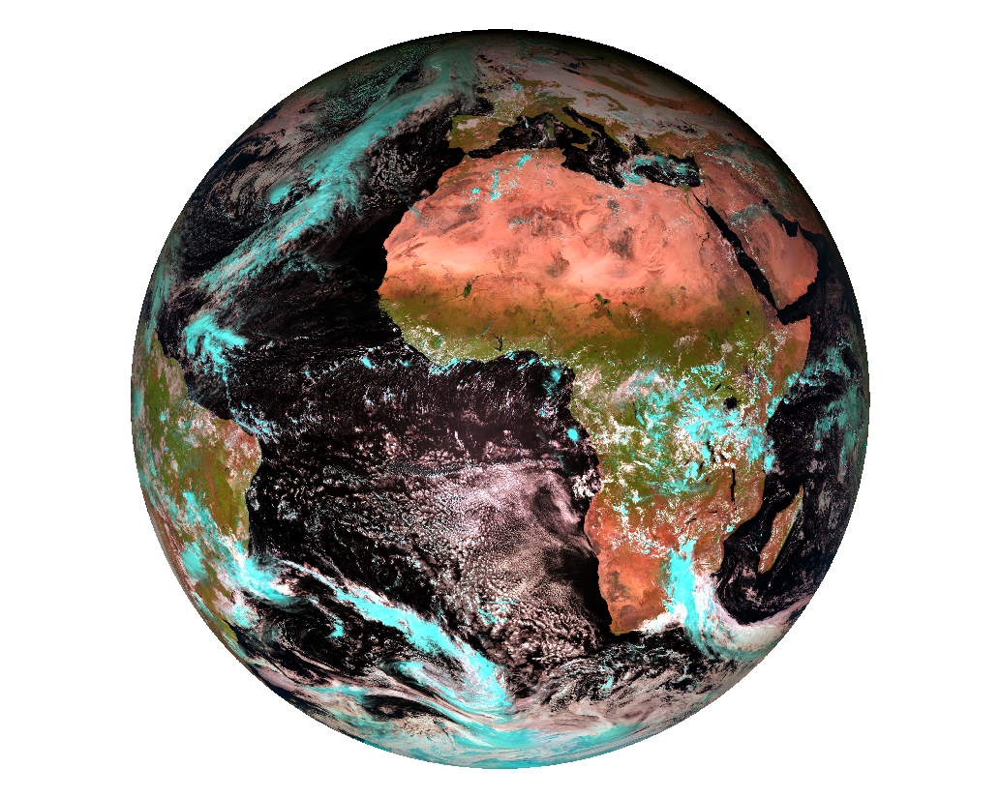
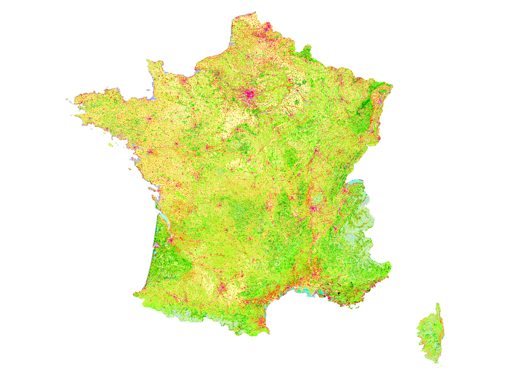
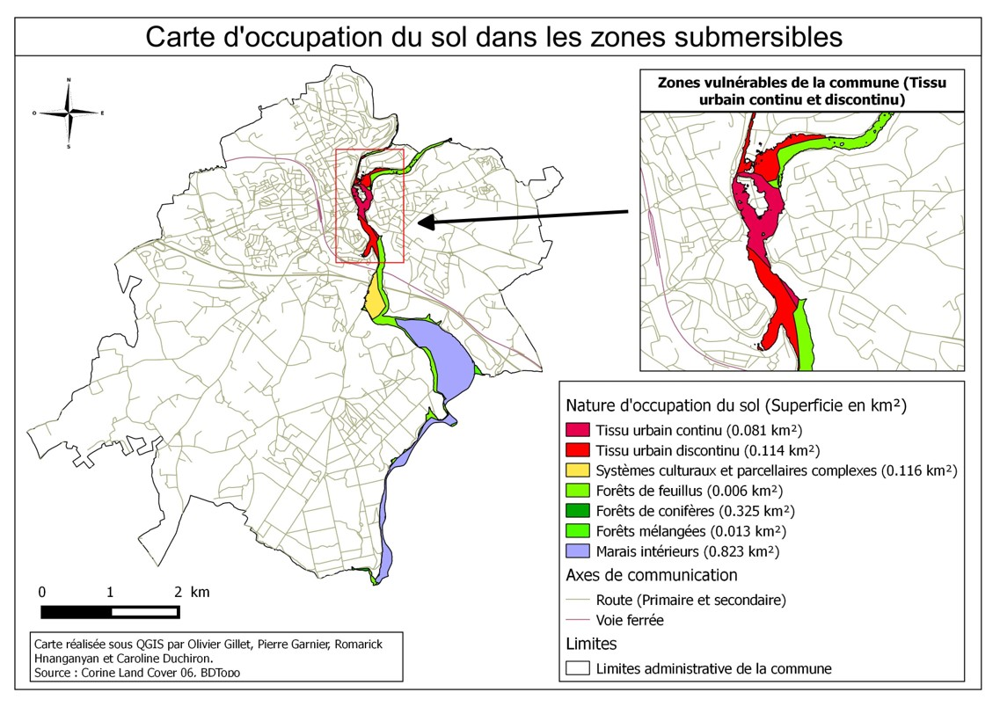

# Manipulation des SIG

* Tutorial Permière utilisation des SIG (QGIS) <a href="documents/OGR_CHEATSHEET_2020.pdf" download>Cliquez ici pour le télécharger</a>

* Tutorial Météosat Seconde Génération (MSG-4) <a href="documents/MSG.pdf" download>Cliquez ici pour le télécharger</a>

* Tutorial Corine Land Cover (CLC) <a href="documents/CLC.pdf" download>Cliquez ici pour le télécharger</a>

* Exercice - Estimer la hauteur d'eau dans les bâtiments <a href="documents/CLC.pdf" download>Cliquez ici pour le télécharger</a>

